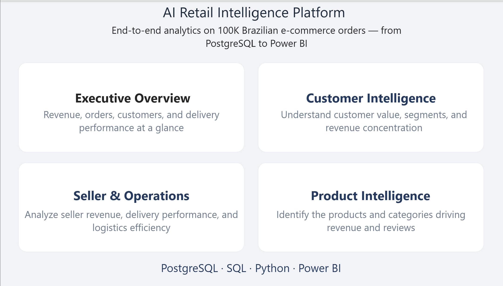
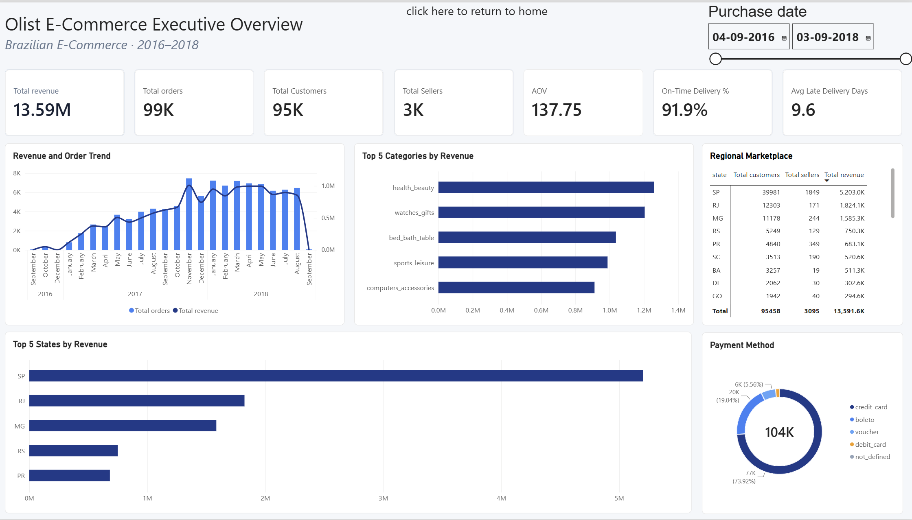
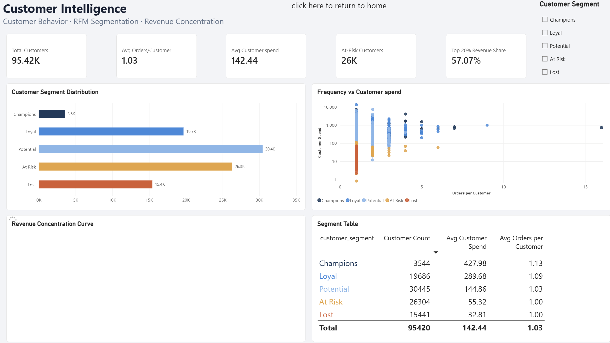
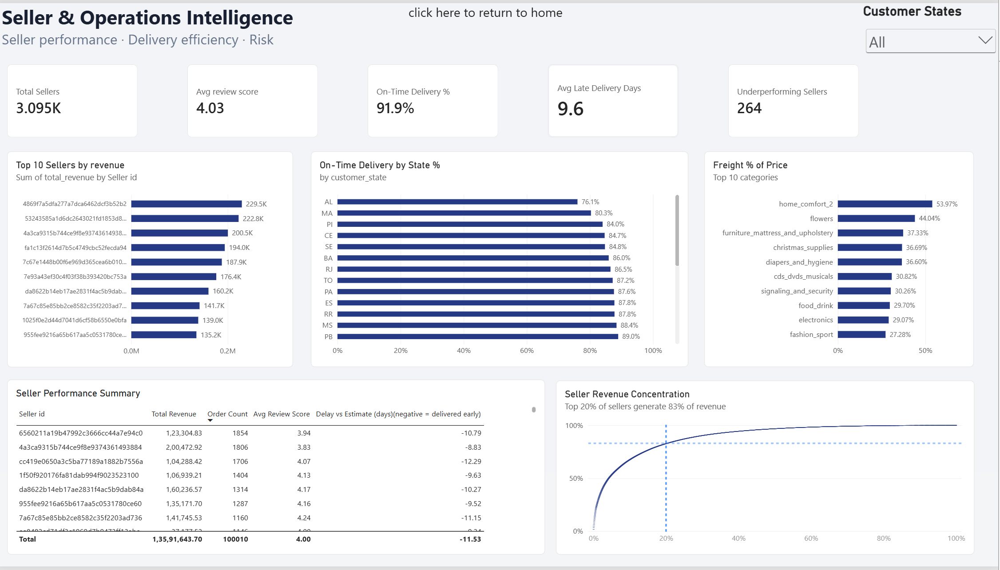
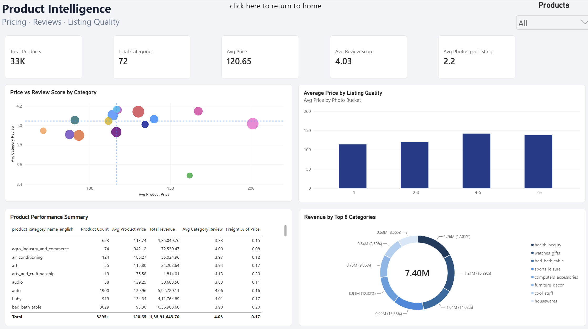

# AI Retail Intelligence Platform

An end-to-end e-commerce analytics project built with **PostgreSQL, SQL, and Power BI** on the Brazilian Olist dataset. Raw transactional tables are turned into reusable analytical views, validated KPIs, and an interactive five-page Power BI dashboard covering sales, customers, sellers, and products.

> **Status:** SQL layer and Power BI dashboard are complete. Python-based customer segmentation (K-Means) is planned next.

## 📊 Dashboard Preview

The dashboard opens on a landing page with navigation cards to four analytical pages. Every analytical page has a "return to home" button.

### Landing Page


### 1. Executive Overview
Top-line revenue, orders, customers, sellers, AOV, and delivery KPIs, with monthly trend, top categories and states, a regional marketplace table, and payment-method mix.



### 2. Customer Intelligence
RFM segmentation (Champions, Loyal, Potential, At Risk, Lost), frequency-vs-spend behavior, and revenue concentration.



### 3. Seller & Operations Intelligence
Seller revenue, on-time delivery by state, freight cost relative to price, and seller revenue concentration.



### 4. Product Intelligence
Price vs. review score by category, the effect of listing quality (photo count) on price, and category-level performance.



## 🔑 Key Findings

| Metric | Value |
|---|---|
| Total revenue | R$ 13.59M across ~99K orders |
| Customers / sellers | ~95K customers, ~3.1K sellers |
| Average order value | R$ 137.75 |
| On-time delivery | 91.9% |
| Repeat-purchase rate | 3.05% (avg 1.03 orders per customer) |
| Customer revenue concentration | Top 20% of customers generate ~57% of revenue |
| Seller revenue concentration | Top 20% of sellers generate ~83% of revenue |

- **This is an acquisition-driven marketplace.** With only ~3% repeat customers, growth depends on bringing in new customers rather than retaining existing ones.
- **Seller concentration is high.** A small share of sellers drives most revenue, which is a dependency risk for the marketplace.
- **Freight cost varies sharply by category.** Bulky or low-value categories (for example `home_comfort_2` and `flowers`) carry freight at roughly 40-55% of item price, compared with ~27-30% for categories like fashion and electronics.
- **Listing quality shows a pattern.** Average price rises with photo count, which suggests richer listings are associated with higher-priced products.

## 🎯 Project Objectives

- Analyze revenue, order volume, AOV, and delivery performance.
- Understand customer purchasing behavior and revenue concentration.
- Evaluate seller performance and operational efficiency.
- Identify high-performing categories and regional trends.
- Build reusable SQL views so Power BI never queries raw tables directly.

## 🛠️ Tech Stack

| Technology | Purpose |
|---|---|
| PostgreSQL | Data storage and transformation |
| SQL | Exploration, cleaning, analytical views, KPI queries |
| Python | Loading the CSV files into PostgreSQL (`src/`); planned segmentation work |
| Power BI | Interactive dashboard |
| Scikit-learn | *Planned:* K-Means customer segmentation |

## 📁 Dataset

**[Brazilian E-Commerce Public Dataset by Olist (Kaggle)](https://www.kaggle.com/datasets/olistbr/brazilian-ecommerce)**: roughly 100K orders from 2016 to 2018 across nine tables:

`customers`, `orders`, `order_items`, `order_payments`, `order_reviews`, `products`, `sellers`, `geolocation`, `product_category_name_translation`

The geolocation table has multiple rows per ZIP-code prefix, so it is aggregated into a cleaned view before being used anywhere, to avoid duplicating rows in joins.

## 🗄️ SQL Workflow

| File | Purpose |
|---|---|
| `sql/01_exploration.sql` | Explore tables and distributions |
| `sql/02_cleaning.sql` | Data-quality checks and cleaning |
| `sql/03_views.sql` | Reusable analytical views |
| `sql/04_kpi_queries.sql` | KPI calculations and business questions |

### Analytical Views

| View | Grain | Used for |
|---|---|---|
| `vw_sales` | Order item | Base sales fact view (orders, items, customers, products, sellers, payments, reviews) |
| `vw_customer_rfm` | Customer | Recency, frequency, monetary value and segment label |
| `vw_seller_performance` | Seller | Revenue, orders, review score, delivery delay |
| `vw_geo_clean` | ZIP prefix | Aggregated geolocation |
| `vw_regional_overview` | State | Regional marketplace table |
| Payment-method view | Payment type | Payment mix |

## 🔍 Data Quality and Validation

Two issues surfaced while building the dashboard. Both were investigated against raw SQL rather than assumed.

**1. Delivery delay: two different numbers that were both correct.**
The Executive KPI "Avg Late Delivery Days" (9.6) was positive while the seller table showed negative averages (around -10 to -12). Direct SQL checks showed they answer different questions: the KPI averages delay among late orders only, while the seller column averages the signed difference between actual and estimated delivery across all orders. Most orders arrive earlier than estimated, so that average is negative. The seller column was relabeled **"Delay vs Estimate (days), negative = delivered early"** to remove the ambiguity.

**2. Freight % of price: a report-level bug.**
A chart showed freight above 100% of price for several categories (for example ~180% for `home_comfort_2`). Running the same `SUM(freight_value) / SUM(price)` directly in SQL on the same view gave ~54% for `home_comfort_2` and ~44% for `flowers`. The row counts and sums in `vw_sales` matched the raw tables, so the data layer was correct. The visual was rebuilt from scratch with a fresh measure, and it then matched the SQL results.

## 📂 Project Structure

```text
ai-retail-intelligence-platform/
├── data/raw/          # Olist CSV files go here
├── sql/
│   ├── 01_exploration.sql
│   ├── 02_cleaning.sql
│   ├── 03_views.sql
│   └── 04_kpi_queries.sql
├── src/               # Python scripts for loading data into PostgreSQL
├── dashboard/         # Power BI (.pbix) file
├── screenshots/       # Dashboard page screenshots used in this README
├── requirements.txt
├── LICENSE
└── README.md
```

## 🚀 How to Run

1. **Download** the Olist dataset from Kaggle and place the CSVs in `data/raw/`.
2. **Create the database:** `CREATE DATABASE retail_analytics;`
3. **Load the data** into PostgreSQL using the scripts in `src/` (`pip install -r requirements.txt` first).
4. **Run the SQL scripts in order:** `01_exploration.sql`, `02_cleaning.sql`, `03_views.sql`, `04_kpi_queries.sql`.
5. **Open the `.pbix` file** in the `dashboard/` folder with Power BI Desktop, point the PostgreSQL connection at your local `retail_analytics` database, and refresh.

## 🗺️ Roadmap

- [x] Explore and clean the Olist dataset
- [x] Build analytical SQL views and KPI queries
- [x] Build the five-page Power BI dashboard
- [x] Validate delivery-delay and freight metrics against raw SQL
- [ ] Python RFM segmentation with K-Means, compared against the current rule-based segments
- [ ] Optional: churn-risk analysis if the segmentation results support it

## 👨‍💻 Author

**Tharunadithya**: [@Tharunadithya133](https://github.com/Tharunadithya133)

---

*Built as a portfolio project to demonstrate SQL analysis, data modeling, business intelligence, and dashboard design.*
